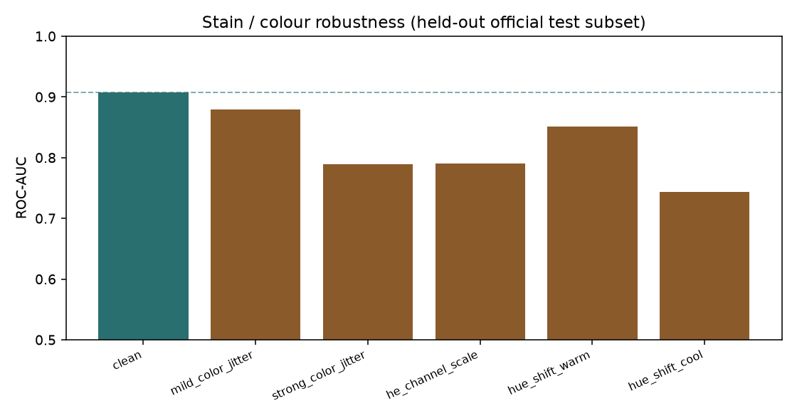
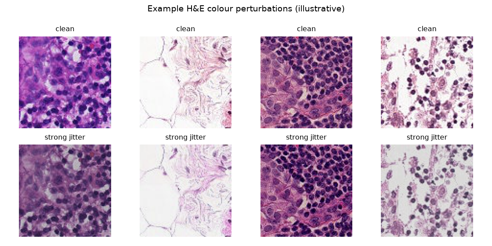

# Stain / colour robustness (draft experiment)

> Educational research check — not a clinical validation. Surabhi owns interpretation and can extend this.

## Method

Held-out fixed-seed subset of the official PCam test split. Perturbations: mild/strong ColorJitter (hue/saturation/brightness/contrast), approximate H&E RGB channel scaling, and fixed warm/cool hue shifts. Not full Macenko or Vahadane stain normalization — those were out of scope for this CPU VM; a principled simpler colour jitter is used instead.

- Evaluation subset: **2000** patches from the official PCam **test** split (fixed seed `49`; within-split shuffle only).
- Checkpoint: `export/best_model.pt` (backbone `resnet18`, run `baseline_fuller_run`).
- Decision threshold: 0.5.

## Knobs

```json
{
  "max_eval_samples": 2000,
  "seed": 42,
  "index_seed": 49,
  "batch_size": 64,
  "decision_threshold": 0.5,
  "backbone": "resnet18",
  "checkpoint": "export/best_model.pt",
  "source_run_id": "baseline_fuller_run"
}
```

## Results

| Perturbation | Accuracy | ROC-AUC | Δ Acc vs clean | Δ AUC vs clean | Mean |ΔP| vs clean |
|---|---:|---:|---:|---:|---:|
| `clean` | 0.7900 | 0.9077 | +0.0000 | +0.0000 | 0.0000 |
| `mild_color_jitter` | 0.7605 | 0.8796 | -0.0295 | -0.0281 | 0.0904 |
| `strong_color_jitter` | 0.6765 | 0.7886 | -0.1135 | -0.1191 | 0.1790 |
| `he_channel_scale` | 0.6635 | 0.7902 | -0.1265 | -0.1175 | 0.1700 |
| `hue_shift_warm` | 0.7380 | 0.8506 | -0.0520 | -0.0571 | 0.1411 |
| `hue_shift_cool` | 0.6430 | 0.7437 | -0.1470 | -0.1640 | 0.1840 |





## What this does *not* cover

- Macenko stain normalization
- Vahadane stain separation
- scanner-specific colour profiles
- cross-lab external cohorts

## Takeaway (honest, draft)

If AUC or accuracy drops under strong colour / H&E-ish shifts, the model is partly relying on stain appearance rather than morphology alone. Mild shifts should stay closer to clean performance. Surabhi can use this table when writing Results limitations and when planning stain-augmentation for a future Colab run.

